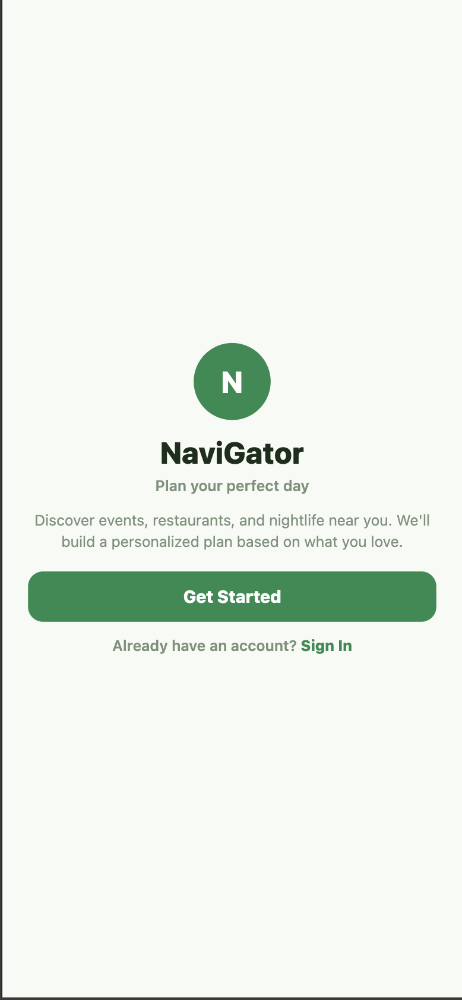
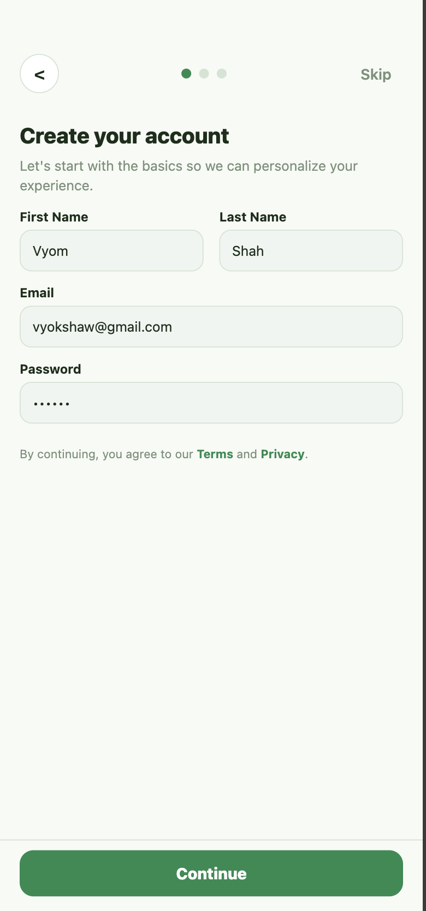
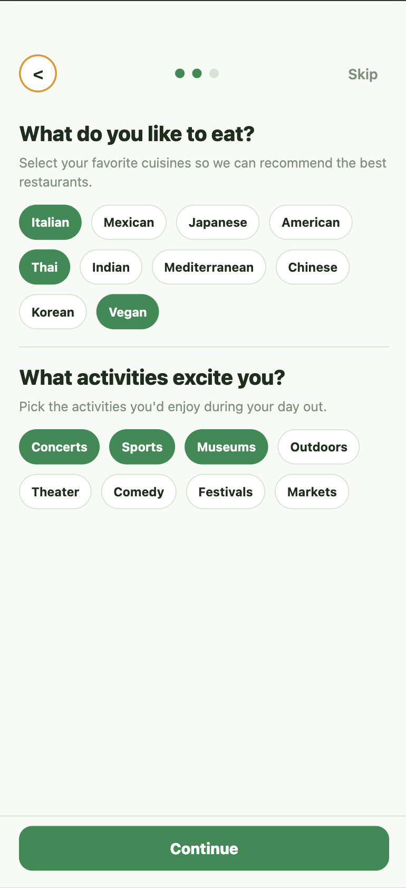
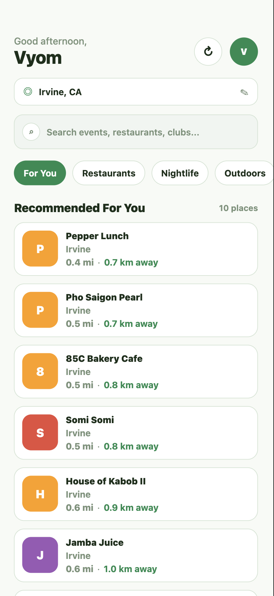

# NaviGator

A location-aware activity recommendation app that helps you discover restaurants, nightlife, outdoor activities, arts & entertainment, and more — personalized to your tastes and the current weather.

---

## Table of Contents

- [Overview](#overview)
- [Screenshots](#screenshots)
- [Tech Stack](#tech-stack)
- [Architecture](#architecture)
- [Features](#features)
- [Getting Started](#getting-started)
  - [Prerequisites](#prerequisites)
  - [Backend Setup](#backend-setup)
  - [Frontend Setup](#frontend-setup)
- [Environment Variables](#environment-variables)
- [API Reference](#api-reference)
- [Recommendation Algorithm](#recommendation-algorithm)
- [Project Structure](#project-structure)

---

## Overview

NaviGator combines real-time location data, live weather conditions, and your personal preferences to surface the best activities near you. After a quick onboarding flow where you pick your food tastes, activity interests, nightlife preferences, and budget range, the app continuously learns from your ratings to improve future suggestions.

---

## Screenshots

### Welcome Screen
The opening page greets users and routes them into the sign-up or sign-in flow.



---

### Account Creation
Users create their account with a first name, last name, email, and password — backed by Firebase Authentication.



---

### Profile & Preference Setup
A multi-step onboarding wizard lets users select their food preferences, activity interests, nightlife categories, and budget tier. These preferences drive the personalized recommendation engine.



---

### Main Recommendations Feed
After onboarding, users land on the home screen showing ranked recommendations based on their location, current weather, and saved preferences. Tabs filter by category: For You, Restaurants, Nightlife, Outdoors, and Arts.



---

## Tech Stack

### Mobile Frontend

| Technology | Version | Purpose |
|---|---|---|
| React Native | 0.81.5 | Cross-platform mobile framework |
| Expo | 54.0.33 | Development toolchain & native APIs |
| Expo Router | 6.0.23 | File-based navigation |
| TypeScript | 5.9.2 | Type safety |
| Firebase JS SDK | 12.9.0 | Auth & Firestore client |
| Axios | 1.13.6 | HTTP client with auth token injection |
| React Native Reanimated | — | Smooth animations |
| Expo Location | 19.0.8 | GPS & device location |
| React Navigation | — | Bottom tabs & screen transitions |

### Backend

| Technology | Purpose |
|---|---|
| Python 3 | Runtime |
| FastAPI | REST API framework |
| Uvicorn | ASGI server |
| Firebase Admin SDK | Server-side Firestore & token verification |
| python-dotenv | Environment variable management |

### External APIs

| API | Purpose |
|---|---|
| **Foursquare Places API** | Primary venue data source — names, ratings, categories, distances |
| **OpenWeather API** | Real-time weather for outdoor suitability scoring |
| **Geocode Maps API** (`geocode.maps.co`) | City/state → lat/lon conversion |

### Cloud Services

| Service | Purpose |
|---|---|
| **Firebase Authentication** | Email/password sign-up and sign-in |
| **Cloud Firestore** | Stores user preferences and activity history |

---

## Architecture

```
┌─────────────────────────────────────────┐
│         React Native (Expo)             │
│                                         │
│  ┌──────────┐  ┌──────────────────────┐ │
│  │  Auth    │  │  Recommendation Feed │ │
│  │  Flow    │  │  + Category Filters  │ │
│  └────┬─────┘  └──────────┬───────────┘ │
│       │                   │             │
│  Firebase Auth        services/api.ts   │
│  (ID Token)           (Axios + token)   │
└───────┼───────────────────┼─────────────┘
        │                   │
        ▼                   ▼
┌───────────────────────────────────────┐
│           FastAPI Backend             │
│                                       │
│  auth_middleware.py (JWT verify)      │
│                                       │
│  /api/recommendations/personalized    │
│  /api/recommendations                 │
│  /api/user/preferences                │
│  /api/user/activity/rate              │
│  /api/weather  /api/geocode           │
└──────┬────────────────┬───────────────┘
       │                │
       ▼                ▼
  Firestore       External APIs
  (user data)  (Foursquare, OpenWeather,
               Geocode Maps)
```

**Request flow:**
1. The mobile app authenticates via Firebase and receives a short-lived ID token.
2. Every API call to the FastAPI backend automatically attaches this token via an Axios interceptor.
3. `auth_middleware.py` verifies the token with Firebase Admin SDK and extracts the user's UID.
4. The backend fetches venue data from Foursquare, weather from OpenWeather, and user preferences from Firestore, then ranks results and returns them.

---

## Features

- **Personalized onboarding** — multi-step wizard covering food, activities, nightlife, and budget preferences
- **GPS-based discovery** — uses device location or lets you search any city
- **Category tabs** — filter by For You, Restaurants, Nightlife, Outdoors, Arts
- **Weather-aware ranking** — outdoor activities are scored down during rain/snow
- **Composite scoring** — each recommendation is ranked by distance, weather suitability, venue rating, and category match
- **Activity rating** — rate activities 1–5 stars to improve future suggestions
- **Activity history** — view a log of past rated activities
- **Dark/light mode** — respects system theme
- **Cross-platform** — runs on iOS, Android, and web

---

## Getting Started

### Prerequisites

- Node.js 18+
- Python 3.10+
- Expo CLI (`npm install -g expo-cli`)
- A Firebase project with Authentication and Firestore enabled
- API keys for Foursquare, OpenWeather, and Geocode Maps

---

### Backend Setup

```bash
cd FastAPI-Backend

# Create and activate a virtual environment
python -m venv venv
source venv/bin/activate        # Windows: venv\Scripts\activate

# Install dependencies
pip install -r requirements.txt

# Copy the environment template and fill in your keys
cp .env.example .env

# Add your Firebase service account key as serviceAccountKey.json

# Start the server
uvicorn app:app --reload --port 8000
```

The API will be available at `http://localhost:8000`. Interactive docs at `http://localhost:8000/docs`.

---

### Frontend Setup

```bash
cd Mobile-Frontend/NaviGator

# Install dependencies
npm install

# Create a .env file with your Firebase config (see Environment Variables)

# Start the Expo dev server
npx expo start
```

Press `i` for iOS simulator, `a` for Android emulator, or scan the QR code with Expo Go on your device.

---

## Environment Variables

### Backend (`.env`)

```env
GEOCODE_API_KEY=your_geocode_maps_api_key
FOURSQUARE_API_KEY=your_foursquare_api_key
OPENWEATHER_API_KEY=your_openweather_api_key
```

You also need a `serviceAccountKey.json` file from your Firebase project's **Project Settings → Service Accounts**.

### Frontend (`.env`)

```env
EXPO_PUBLIC_FIREBASE_API_KEY=
EXPO_PUBLIC_FIREBASE_AUTH_DOMAIN=
EXPO_PUBLIC_FIREBASE_PROJECT_ID=
EXPO_PUBLIC_FIREBASE_STORAGE_BUCKET=
EXPO_PUBLIC_FIREBASE_MESSAGING_SENDER_ID=
EXPO_PUBLIC_FIREBASE_APP_ID=
EXPO_PUBLIC_API_BASE_URL=http://localhost:8000
```

---

## API Reference

| Method | Endpoint | Description |
|---|---|---|
| `GET` | `/api/recommendations` | Get recommendations by lat/lon or city/state |
| `GET` | `/api/recommendations/personalized` | Recommendations using saved user preferences |
| `GET` | `/api/places/{fsq_id}` | Full details for a single venue |
| `GET` | `/api/weather` | Current weather for a location |
| `GET` | `/api/geocode` | Convert city/state to lat/lon |
| `POST` | `/api/user/preferences` | Save user onboarding preferences |
| `GET` | `/api/user/preferences` | Retrieve user preferences |
| `POST` | `/api/user/activity/rate` | Submit a 1–5 star activity rating |
| `GET` | `/api/user/activity/history` | Get the user's activity history |

All endpoints except geocoding require a Firebase ID token in the `Authorization: Bearer <token>` header.

**Example — get recommendations:**
```
GET /api/recommendations?lat=37.7749&lon=-122.4194&activity_types=food,outdoors&budget=moderate&max_distance=5000
```

---

## Recommendation Algorithm

Each venue returned from Foursquare is assigned a composite score:

```
score = (w_distance  × distance_score)
      + (w_weather   × weather_score)
      + (w_rating    × rating_score)
      + (w_category  × category_match_score)
```

| Factor | Description |
|---|---|
| **Distance score** | Inverse of normalized distance — closer venues score higher |
| **Weather score** | 0–1 suitability score; outdoor activities are penalized in rain/snow |
| **Rating score** | Normalized Foursquare venue rating (0–10 → 0–1) |
| **Category match** | How closely the venue's category aligns with user preferences |

Weights default to equal (0.25 each) but can be overridden per-request. User preferences stored in Firestore feed into both the category filtering and the weight configuration.

**Weather suitability mapping:**

| Condition | Score |
|---|---|
| Clear | 1.0 |
| Clouds | 0.8 |
| Drizzle | 0.5 |
| Rain / Snow / Thunderstorm | 0.2 |

---

## Project Structure

```
NaviGator/
├── FastAPI-Backend/
│   ├── app.py                    # All API routes and ranking logic
│   ├── firebase_admin_config.py  # Firestore initialization
│   ├── auth_middleware.py        # Firebase JWT verification
│   ├── requirements.txt
│   └── .env.example
│
├── Mobile-Frontend/NaviGator/
│   ├── app/
│   │   ├── (auth)/
│   │   │   ├── index.tsx         # Auth entry point
│   │   │   ├── signin.tsx        # Sign-in screen
│   │   │   └── signup.tsx        # Multi-step onboarding
│   │   ├── (tabs)/
│   │   │   ├── _layout.tsx       # Tab bar config
│   │   │   └── index.tsx         # Main recommendation feed
│   │   ├── activity/
│   │   │   └── [id].tsx          # Activity detail page
│   │   └── _layout.tsx           # Root layout
│   ├── components/
│   │   ├── RecommendationCard.tsx
│   │   ├── SearchBar.tsx
│   │   ├── PrimaryButton.tsx
│   │   └── PreferenceChip.tsx
│   ├── services/
│   │   ├── api.ts                # Axios client + typed API methods
│   │   └── auth.ts               # Firebase auth wrapper
│   ├── firebaseConfig.js         # Firebase client initialization
│   └── package.json
│
└── media/                        # App screenshots
    ├── signup.png
    ├── account.png
    ├── profile_making.png
    └── suggestions.png
```
